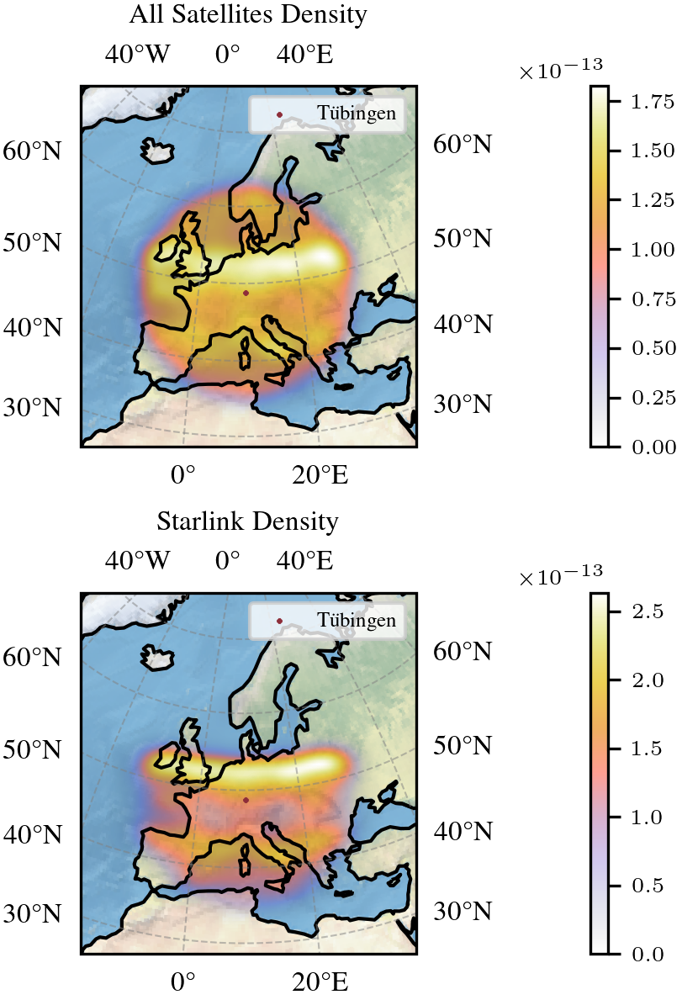

# Satellite Density Evaluation: Investigating Satellite Presence above Tübingen

## Qualitative results: 
Danger heat maps in the area around Tübingen. Satellite density estimations for the total data capture and specifically Starlink satellites. The high-density belt above 50° N corresponds to the operational border of Starlink satellites visualized in the animation below.
<p align="center"></p>


Starlink mesh animation. Subset of satellites is colored in red to easier follow them in time. Notably, most Starlink satellite orbits approach their operation boundary at roughly 53° N. 
<p align="center"></p>

## Installation

Use the package manager [pip](https://pip.pypa.io/en/stable/) to install the requirements.

```bash
python -m pip install -r requirements.txt
```

## Usage

We have created 3 experiments inside the exp folder. You can find all plots and experiments here:
 - [exp_TL_MO_001_SatellitesMystery.ipynb](exp/exp_TL_MO_001_SatellitesMystery.ipynb): First notebook to solve any data capture and preprocessing challenges.
 - [exp_TL_MO_002_Starlink_Analysis.ipynb](exp/exp_TL_MO_002_Starlink_Analysis.ipynb): Second notebook for the main density and Starlink analysis.
 - [exp_SV_003_ExploreTimeComponent.py](exp/exp_SV_003_ExploreTimeComponent.py): Final notebook to create satellite animations.

Source code for data loading and kernel density estimation is provided in the scr folder. 

## Data
Our captured satellites dataset can be found in the dat folder. We provide the functionality to collect your own data samples for different capture length and intervals. You can find the shell scripts [api_call.sh](src/data_collection/api_call.sh) and [run.sh](src/data_collection/run.sh) in the src/data_collection folder.

## Contribution
Sebastian Volz collected satellites data using API calls and was responsible for satellite animations. Meike Oschmann and Timo Lübbing performed the data preparation and analysis by means of kernel density estimation. Both contributed to producing visualizations. All authors jointly wrote the text of this [report](doc/report.pdf). In general, each team member contributed equally in work. 
